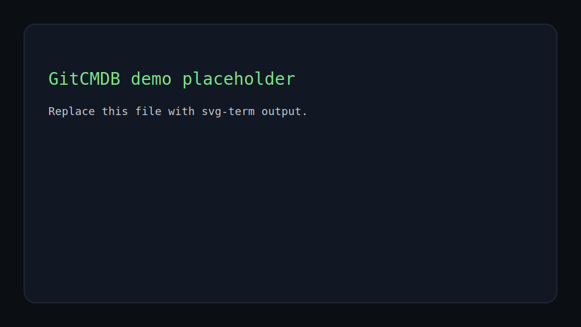

# GitCMDB — Git-backed Configuration Management Database

[](https://github.com/Ibrahim77890/GitCMDB/actions/workflows/ci.yml)
[](https://codespaces.new/Ibrahim77890/GitCMDB)



GitCMDB is a lightweight, filesystem-first CMDB implemented in Bash. It stores infrastructure assets (hosts, services, networks, compliance records) as JSON documents organized by environment and region. Every write is atomic, validated, and recorded in Git so the system provides an auditable, reproducible state journal without a separate database server.

Why this project matters
- Demonstrates practical DevOps engineering with core Linux tooling: Bash, git, jq, ripgrep, awk.
- Shows safe shell engineering: `set -euo pipefail`, atomic writes, `flock`-based locking, schema validation.
- Uses Git as a replication/audit layer and supports time-travel (restore by commit).

Key features
- Filesystem-backed JSON/YAML documents arranged by `data/<env>/<region>/<type>/`.
- Atomic create/update/delete with temp-file swaps and validation.
- Advisory locking using `flock` to avoid write races.
- High-performance read queries using `rg` + `jq` + `awk` pipelines.
- Git-backed transaction journal (one commit per write).
- Simple CLI: `bin/gitcmdb.sh` (init, add, update, get, query, history, validate).

Quick start (local or cloud VM)
1. Ensure dependencies are installed: `git`, `bash` (>=4), `jq`, `ripgrep` (`rg`), `awk`, `sed`.
2. Clone the repo and set the root:

```bash
git clone https://github.com/Ibrahim77890/GitCMDB.git
cd GitCMDB
export GITCMDB_ROOT="$PWD"
```

3. Initialize workspace and schemas:

```bash
./bin/gitcmdb-init.sh
```

4. Seed test data and run a sample query:

```bash
./scripts/seed-data.sh 100 42
./bin/gitcmdb.sh query hosts --env prod --status active
```

Tests
Run the included smoke tests:

```bash
./tests/test-install.sh
./tests/test-write.sh
./tests/test-query.sh
```

Install from release

```bash
curl -sSL https://github.com/Ibrahim77890/GitCMDB/releases/latest/download/gitcmdb-linux-amd64.tar.gz | tar -xz -C /usr/local/
sudo ln -sf /usr/local/gitcmdb/bin/gitcmdb /usr/local/bin/gitcmdb
```

Demo (images)
If you are preparing a visual demo (pictures instead of video), place screenshots in `docs/images/` with descriptive names. Example images and the recommended scenes:

- `docs/images/scene1-seed.png` — Seed output (show generated files)
- `docs/images/scene2-query.png` — Query output (table of active hosts)
- `docs/images/scene3-add.png` — Add host command & resulting file
- `docs/images/scene4-update.png` — Update command & commit message
- `docs/images/scene5-history.png` — Git history (`git log --patch`) showing the change
- `docs/images/scene6-benchmark.png` — Benchmark timings and `report.md`

Embed images in your demo README or slide deck like this:

```markdown


```

Notes for a cloud demo (GCP VM)
- Use an Ubuntu LTS Compute Engine `e2-micro` (free-tier eligible) and follow the same Quick start steps on the VM.
- Ensure Git user identity is configured before `gitcmdb-init.sh` runs, e.g.: 

```bash
git config --global user.email "you@example.com"
git config --global user.name "Your Name"
```

Troubleshooting
- If you see `command not found` errors, install the missing package (`jq`, `rg`) with your distro package manager.
- If CLI scripts complain about `readonly variable` when sourcing libs, run commands under `bash` (not `sh`) and ensure `GITCMDB_ROOT` is exported: `export GITCMDB_ROOT="$PWD"`.
- If Git commits fail with unknown author, configure git user.name/user.email before the first commit.

Where to look next
- `index.md` — full project blueprint and roadmap
- `demo-guide.md` — step-by-step demo instructions and recording tips
- `gcp-testing-guide.md` — instructions to deploy and demo on a GCP VM

Contact
If you want, I can prepare a single `deploy-on-gcp.sh` helper to provision a VM, install dependencies, clone the repo, and bootstrap the demo automatically.

Licensing
This repository has no explicit license file. Add a LICENSE if you want to publish the project publicly.

Enjoy the demo! 🚀

