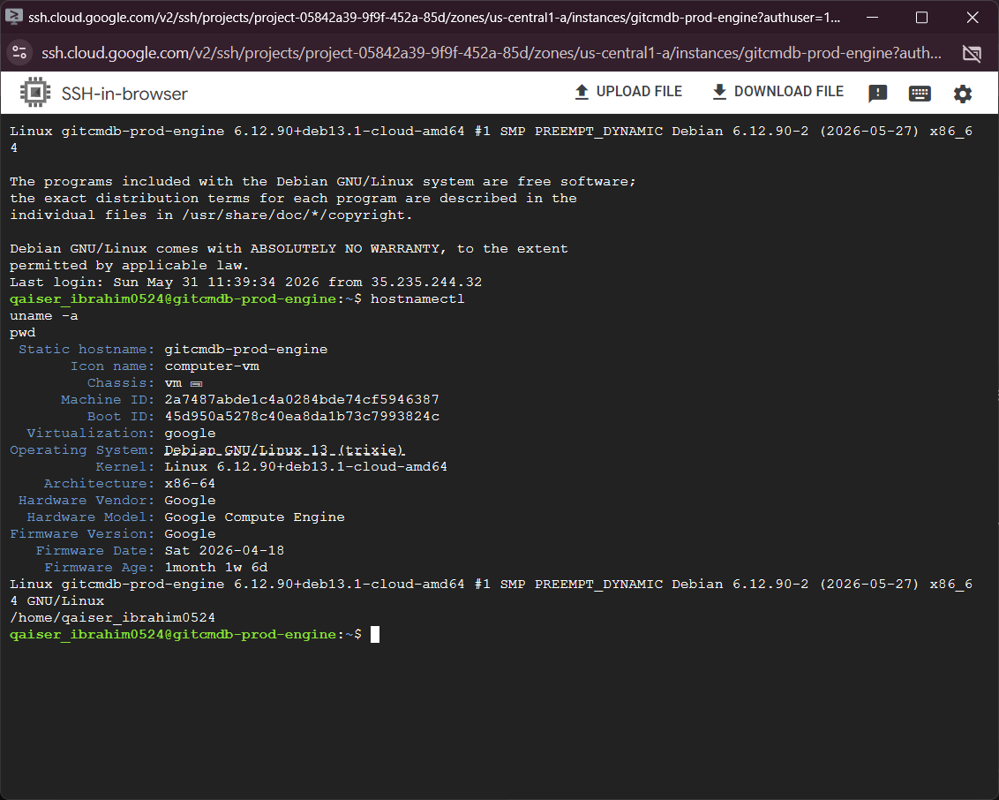
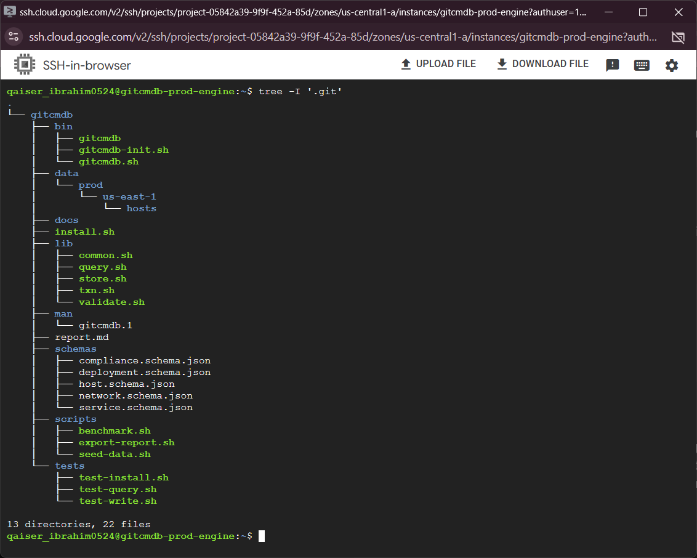
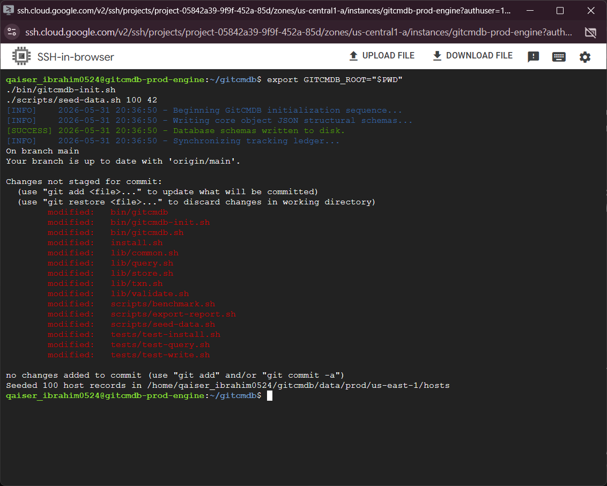
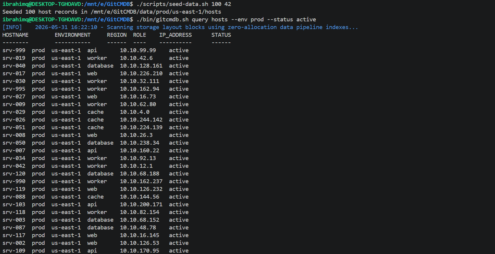
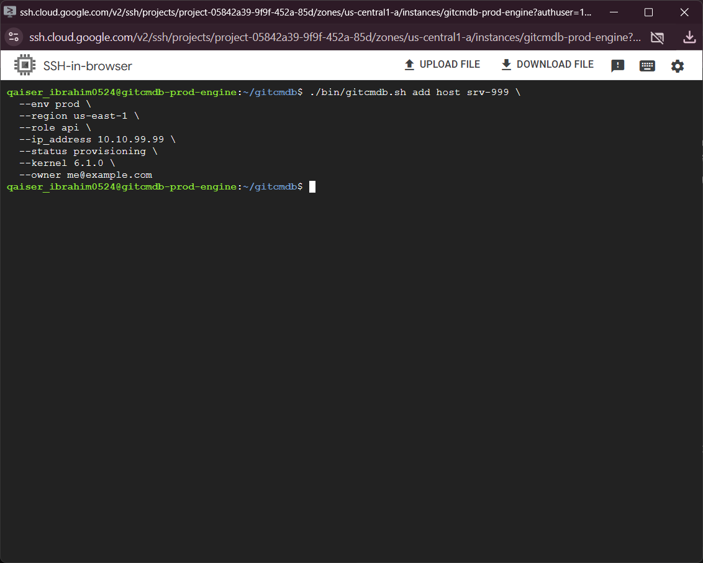
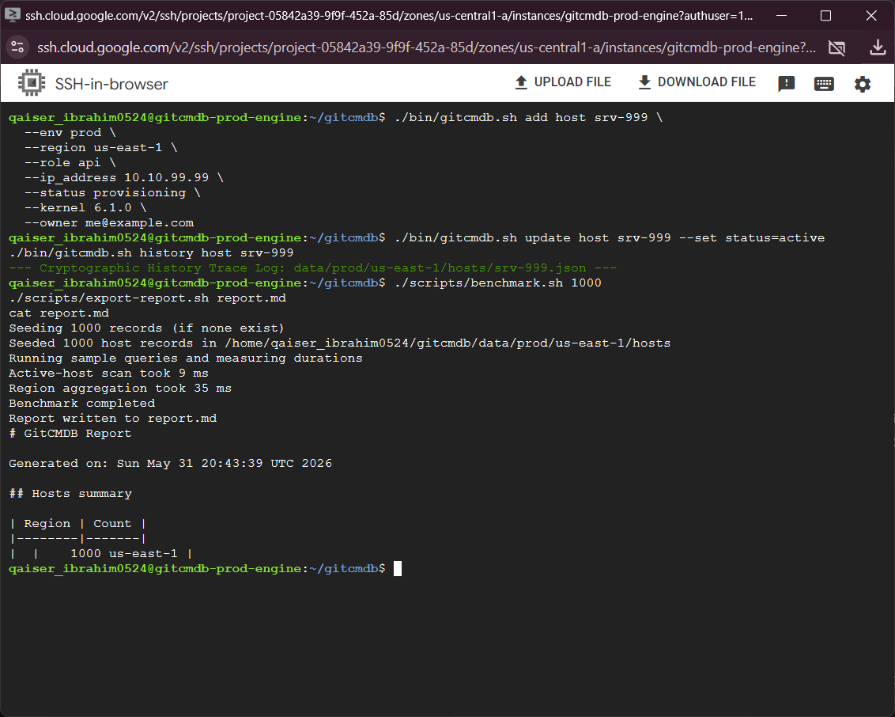

# GitCMDB — Git-backed Configuration Management Database

[](https://github.com/Ibrahim77890/GitCMDB/actions/workflows/ci.yml)
[](https://codespaces.new/Ibrahim77890/GitCMDB)


GitCMDB is a lightweight, filesystem-first CMDB implemented in Bash. It stores infrastructure assets (hosts, services, networks, compliance records) as JSON documents organized by environment and region. Every write is atomic, validated, and recorded in Git so the system provides an auditable, reproducible state journal without a separate database server.

Why this project matters
The point of the project is not to imitate PostgreSQL or SQLite. The point is to build a production-style system that solves a real DevOps problem: tracking infrastructure state in a way that is auditable, reproducible, searchable, and easy to operate from the command line.

- Demonstrates practical DevOps engineering with core Linux tooling: Bash, git, jq, ripgrep, awk.
- Shows safe shell engineering: `set -euo pipefail`, atomic writes, `flock`-based locking, schema validation.
- Uses Git as a replication/audit layer and supports time-travel (restore by commit).

Key features
- Filesystem-backed JSON/YAML documents arranged by `data/<env>/<region>/<type>/`.
- Atomic create/update/delete with temp-file swaps and validation.
- Advisory locking using `flock` to avoid write races.
- High-performance read queries using `rg` + `jq` + `awk` pipelines.
- Git-backed transaction journal (one commit per write).
- Simple CLI: `bin/gitcmdb.sh` (init, add, update, get, query, history, validate).

## Architecture Overview

GitCMDB uses a filesystem-first design instead of a single flat file. Each object is stored as a separate document so you can search, diff, validate, and version it independently.

```text
gitcmdb/
├── bin/
├── lib/
├── data/
│   └── prod/
│       └── us-east-1/
│           ├── hosts/
│           ├── networks/
│           └── services/
├── schemas/
├── docs/
├── tests/
└── scripts/
```

Quick start (local or cloud VM)
1. Ensure dependencies are installed: `git`, `bash` (>=4), `jq`, `ripgrep` (`rg`), `awk`, `sed`.
2. Clone the repo and set the root:

```bash
git clone https://github.com/Ibrahim77890/GitCMDB.git
cd GitCMDB
export GITCMDB_ROOT="$PWD"
```

3. Initialize workspace and schemas:

```bash
./bin/gitcmdb-init.sh
```

4. Seed test data and run a sample query:

```bash
./scripts/seed-data.sh 100 42
./bin/gitcmdb.sh query hosts --env prod --status active
```

Tests
Run the included smoke tests:

```bash
./tests/test-install.sh
./tests/test-write.sh
./tests/test-query.sh
```

Install from release

```bash
curl -sSL https://github.com/Ibrahim77890/GitCMDB/releases/latest/download/gitcmdb-linux-amd64.tar.gz | tar -xz -C /usr/local/
sudo ln -sf /usr/local/gitcmdb/bin/gitcmdb /usr/local/bin/gitcmdb
```

## Operational Demo

### 1. Cloud-Native Execution Environment
The point of the project is not to imitate PostgreSQL or SQLite. The point is to build a production-style system that solves a real DevOps problem. Instead of presenting a local toy script, GitCMDB executes directly on a remote cloud Linux server. Let's verify our hosting environment.



### 2. Filesystem as a Relational Database
The storage framework treats the Linux file system layout as its relational database. Each object is stored as a separate document so you can search, diff, validate, and version it independently. Let's look at the codebase layout.



### 3. Initialization and Deterministic Seeding
We will export our environment root variable, invoke our initialization binary to deploy the structural directories, and seed 100 deterministic JSON records to simulate a data tier.



### 4. Zero-Allocation Query Pipelines
Instead of maintaining a heavy database engine, we process read workloads using zero-allocation pipelines (`rg` + `jq` + `awk`). Let's query production hosts that are currently active. This ensures operators can query and validate state quickly from Bash.



### 5. ACID-Like Atomic Write Path
Let's add a new asset record. The engine processes writes through a strict write path: input validation, file locking via `flock` to prevent race conditions, writing to a temp space, schema contract matching, and an atomic POSIX rename `mv` operation. Every change is tracked in the Git ledger so the full history is preserved.



### 6. System Limits and Scale Benchmarking
To conclude, we will test the engine's limits by scaling our file footprint to 1,000 data blocks, running latency metrics, and exporting a summary document. This demonstrates the performance capability across thousands of mock JSON records.


